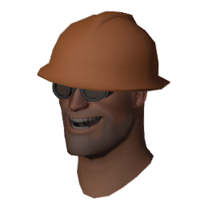
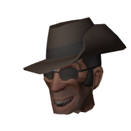
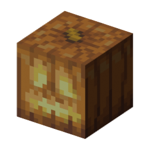

# PASS Time JACK Switcher

Custom skins for the JACK (the ball in TF2's PASS Time mode), plus PASS Time crosshairs, icons, sounds and extras, all switchable from one menu. Works on Windows and Linux.

## Download

Grab one from the [Releases page](../../releases/latest):

| File | What it is |
|---|---|
| `PASS Time JACK Switcher.bat` | Windows, one file. Double-click it. |
| `pass-time-jack-switcher.sh` | Linux, one file. Run `bash pass-time-jack-switcher.sh`. |
| `PASS Time JACK Switcher.zip` | Windows, folder version. Unzip and run `JACK Switcher.bat`. |

You can also clone this repo and run `JACK Switcher.bat` directly. It's the same as the zip.

## How to use

1. Close TF2.
2. Open the switcher.
3. Pick a JACK skin, crosshair, icon set and sound set, and turn any extras on or off. Highlighted cards are what's installed.
4. Start TF2. To test offline, open the console and type `map pass_brickyard`.

The switcher finds TF2 through Steam automatically (including extra library drives, and Flatpak or Snap Steam on Linux). If it can't, it asks for your `Team Fortress 2` folder once and remembers it.

The one-file versions unpack themselves the first time, into `%LOCALAPPDATA%\JACKSwitcher` on Windows or `~/.local/share/jack-switcher` on Linux. On Linux you get simple pick-lists if `zenity` is installed, otherwise a menu in the terminal.

## What's included

**JACK skins**
- TF2 heads: Pootis Heavy, Angry Heavy, Happy Heavy, Scout, Soldier, Pyro, Demoman, Engineer, Medic, Sniper, Spy
- Minecraft: Grass Block, TNT, Diamond Ore, Crafting Table, Oak Log, Bookshelf, Furnace, Diamond Block, Gold Block, Obsidian, Command Block
- Spooky: Jack o'Lantern, Carved Pumpkin, Creeper Head, Skeleton Skull, Wither Skull, Zombie Head, Spawner, Soul Sand, Netherrack, Crying Obsidian, Bone Block, Sculk
- Nyan Cat

Every skin is the same size as the normal JACK and keeps the normal ball physics. The ball turns strongly red or blue depending on which team has it. Skins also replace the Halloween pumpkin JACK, so they work during Scream Fortress.

**Crosshairs:** PASS Time throwing reticles by kin, slamborghini, exer and Laxson, including "no ring" versions.

**Icons:** kin's PASS Time icons.

**Sounds:** Snappy lock-on, pickup and catch sounds by Mr Boom Snook, or a set of clean beeps.

**Extras** (on/off):
- Silent Crowd, Silent Horns + Whistle, Silent Ball Hum, Silent TV + Scrolls
- Left hand removers for Soldier, Demoman and Medic
- No Power Meter
- Practice Configs

## Notes

- Custom files only work on servers with `sv_pure 0`. On stricter servers the game uses the defaults.
- The switcher only adds or removes its own files in `tf/custom` (`jack_*`, `pt_xhair_*`, `pt_icon_*`, `pt_sound_*`, `extra_*`). It doesn't touch anything else.
- **Practice Configs** adds `pt_practice`, `pt_practice_arena`, `pt_practice_stadium` and `pt_practice_amsterdam`. Run one with `exec` on a local server. They turn on `sv_cheats` and rebind 2, E, F1, F2, Mouse3 and Mouse5, and those binds stay afterwards.
- **No Power Meter** uses the default HUD's layout for the PASS Time ball panel, so it may look a bit different with a custom HUD.
- kin's newer crosshair pack (`pt_xhairs_k1-18`) isn't included, but the switcher supports it. Put its `pt_xhair_*.vpk` files in the `crosshairs` folder (inside the unpack folder for the one-file versions).
- Windows may warn about running a downloaded `.bat`. The switcher is plain PowerShell (`app/switcher.ps1`) and Bash, so you can read exactly what it does.

## Uninstall

Pick the defaults in each tab and turn extras off, or delete the files listed above from `Team Fortress 2/tf/custom`.

## Credits

- TF2 heads use Team Fortress 2's models and textures (Valve).
- Minecraft skins use Minecraft's textures (Mojang). Unofficial fan project, not affiliated with or endorsed by Mojang or Valve.
- From the [PASS Time archive](https://github.com/p4sstime/archive) (GPL-3.0, see `LICENSE-passtime-archive.txt`):
  - Crosshairs by kin, slamborghini, exer and Laxson
  - Icons by kin
  - Snappy sounds by Mr Boom Snook
  - Left hand remover by Ryder Joestar, commissioned by gugle
  - HUD mod and archive fixes by blake++
  - Practice configs by flaresh
