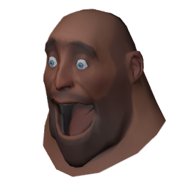
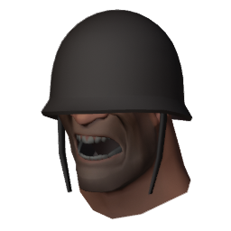
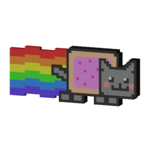
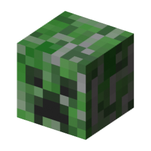
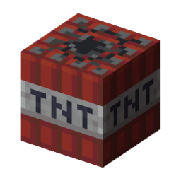

# PASS Time JACK Switcher

JACK skins + crosshairs, icons, sounds and some extras for TF2 PASS Time. Pick stuff from a menu and it installs it for you.

    

## Download

Get it from [Releases](../../releases/latest):
- Windows: `pass-time-jack-switcher.bat` (or the .zip)
- Linux: `pass-time-jack-switcher.sh`, run with `bash pass-time-jack-switcher.sh`

Close TF2 first, pick what you want, then start TF2. Test with `map pass_brickyard`.

Needs `sv_pure 0` servers to show up.

## Credits

- TF2 heads use Valve's models/textures, Minecraft skins use Mojang's textures. Not affiliated with either.
- From the [PASS Time archive](https://github.com/p4sstime/archive) (GPL-3.0, see `LICENSE-passtime-archive.txt`): crosshairs by kin, slamborghini, exer and Laxson, icons by kin, sounds by Mr Boom Snook, left hand remover by Ryder Joestar (commissioned by gugle), HUD mod by blake++, practice configs by flaresh.
